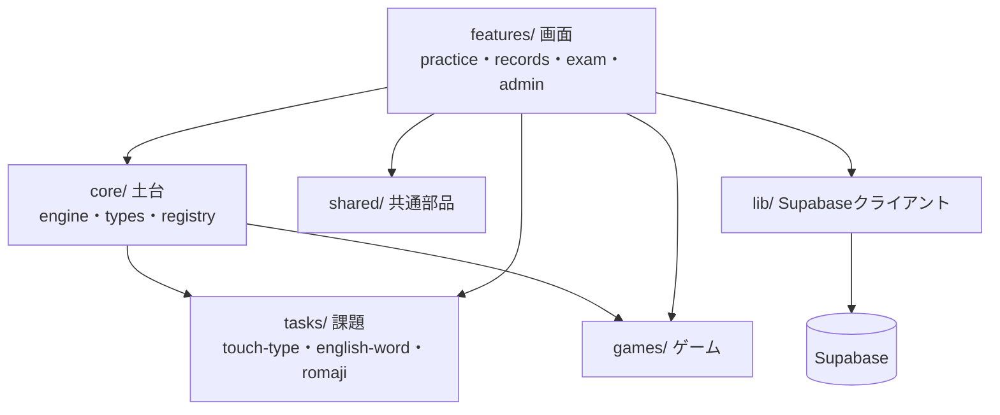
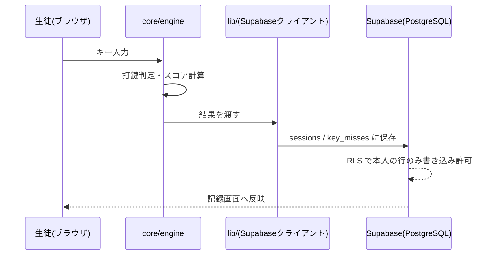
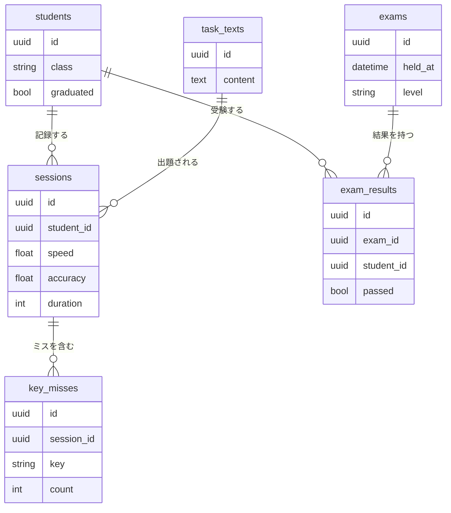
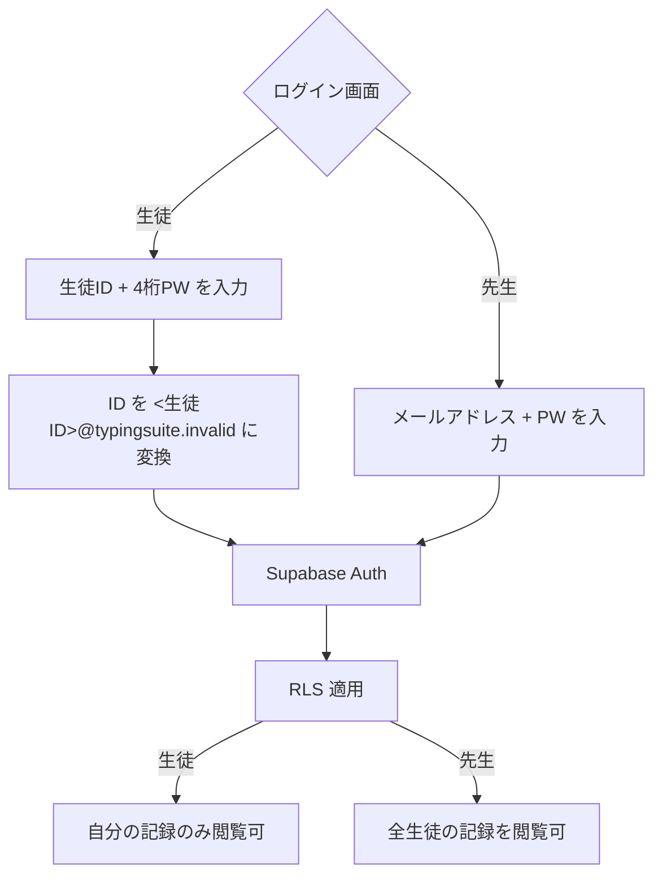
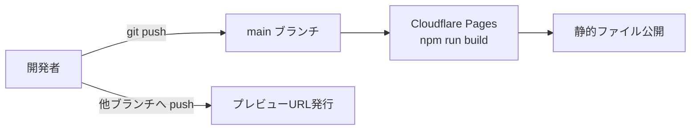

# Architecture

技術スタックと構造の決定事項。**変更には承認が必要。**

## 技術スタック

| 分類 | 採用 | 理由 |
|------|------|------|
| 言語 | TypeScript | 型があると Claude Code の支援精度が上がり、スキル差を埋めやすい。補完で「次に何を書くか」が見える |
| フレームワーク | React | 情報量が多く、詰まったときに調べやすい。画面数が多く状態も複雑なため素の JS では苦しい |
| ルーティング | React Router | 画面の追加が1行で済み、分担しやすい |
| ビルドツール | Vite | 起動が速く設定が最小。保存した瞬間に画面へ反映される |
| データ永続化 | Supabase (PostgreSQL) | DB・認証・APIが揃う。50名なら無料枠で足りる |
| 認証 | Supabase Auth | 自前実装しない。小中学生の記録を預かるため事故リスクを負わない。生徒は ID + 4桁パスワード（下記「認証の方針」参照） |
| グラフ描画 | Recharts | React 向けで記述量が少ない。推移グラフが主用途 |
| テスト | Vitest | Vite と同じ仕組みで動くため追加設定がほぼ不要 |
| lint / formatter | ESLint + Prettier | 書き方の差を自動で吸収する。複数人開発の前提 |
| ホスティング | Cloudflare Workers（Static Assets） | wrangler.jsonc で `dist` を配信。git push で自動公開されるため、作った本人が見せられる |

**却下した選択肢**

| 選択肢 | 却下理由 |
|--------|----------|
| CoreServer + PHP で API を自作 | フロント TS・バック PHP の2言語になり、途中参加のハードルが上がる。認証の自前実装はリスクが重い |
| Node.js API サーバーを CoreServer に置く | CoreServer は Node.js 標準非対応。nvm 導入は自己責任で、運用が不安定になる |
| Vanilla JS（フレームワークなし） | 画面数・状態が多く、規模に対して破綻する |
| Next.js | サーバー機能が不要。静的配信で足りるため構成が過剰 |
| localStorage で記録保存 | 「端末を変えても記録が残る」という concept.md の前提を満たせない |
| 記録を CoreServer(MySQL) に置く | データを自分たちの管理下に置く案。定期バックアップで無料枠リスクを吸収できると判断したため不要になった |
| CoreServer で静的配信 | 契約済みだが FTP の手動アップロードになる。複数人で開発するため、上げ忘れ・上書き事故が起きやすい |

## 実行環境

- 動作対象: PC のモダンブラウザ（Chrome / Edge / Safari 最新版）
- 必要なランタイム・バージョン: Node.js 20 以上（開発時のみ。本番は静的ファイル）
- 画面サイズ: PC 前提。スマホ対応はしない（タイピング練習のため物理キーボード必須）
- 公開方法: main ブランチへの push で自動デプロイ。手動アップロードはしない

## コマンド

Claude が品質チェックで実行するコマンド。
**ここに書かれたものが `/wrapup` で実行される。**

```bash
# セットアップ
npm install

# 開発サーバー起動
npm run dev

# テスト
npm run test

# 型チェック
npm run typecheck

# lint
npm run lint

# ビルド（公開する成果物を作る。通常は push 時に自動実行される）
npm run build
```

## ディレクトリ構成

```
src/
├── core/           # 土台：ここを最初に作る。原則さわらない
│   ├── engine/     # 打鍵判定・スコア計算・ローマ字変換
│   ├── types/      # 課題・結果・セッションの型定義
│   └── registry/   # 課題とゲームの登録場所
├── tasks/          # 課題の種類（1人1ディレクトリで担当）
│   ├── touch-type/
│   ├── english-word/
│   └── romaji/
├── games/          # ゲーム（1人1ディレクトリで担当）
├── features/       # 画面のまとまり
│   ├── practice/   # 練習
│   ├── records/    # 記録・グラフ
│   ├── exam/       # 検定
│   └── admin/      # 管理（先生用）
├── shared/         # 共通の部品（ボタン・レイアウトなど）
└── lib/            # Supabase クライアントなど外部との接続
```

### 責務の境界

| ディレクトリ | 責務 | 誰がさわるか |
|-------------|------|-------------|
| `core/` | 打鍵判定・型・登録の仕組み | 土台担当のみ。変更時は全員に共有 |
| `tasks/` `games/` | 課題・ゲームの中身 | 担当者が自分のディレクトリだけ |
| `features/` | 画面の組み立て | 画面担当 |
| `lib/` | サーバーとのやりとり | 土台担当 |

**`core/` に依存してよいが、`core/` から `tasks/` `games/` を参照しない。**
この向きを守ることで、課題やゲームを足しても土台が壊れない。

## 拡張の仕組み

課題とゲームは **registry への登録**で増やす。土台の書き換えは不要。

```ts
// src/core/types/task.ts（土台側・確定したら変えない）
export type TypingTask = {
  id: string;            // 一意の識別子
  label: string;         // 画面に出す名前
  generate(): Challenge; // 出題を1つ作る
};
```

新しい課題を足す手順は3つ。

1. `src/tasks/自分の課題名/` を作る
2. `TypingTask` を満たすオブジェクトを書く
3. registry に1行追加する

他人のファイルを触らずに済むため、並行して作業できる。

## 認証の方針

生徒にメールアドレスは配られていない。このため **生徒はメールを使わずにログインする。**

| 対象 | ログイン方法 | 発行・管理 |
|------|-------------|-----------|
| 生徒 | ID + 4桁の数字パスワード | 先生が管理画面から発行。忘れたら即リセット |
| 先生 | メールアドレス + 通常のパスワード | 管理者が発行 |

**実装は Supabase Auth に乗せる。**
生徒アカウントは内部的に `<生徒ID>@typingsuite.invalid` の形式のダミーメールで登録し、
画面には「ID」としてだけ見せる。自前の認証を書かずに済ませるための方法。

`.invalid` は実在しないことが保証された予約ドメイン（RFC 2606）。
実在ドメインを使うと、他人のアドレスと衝突する恐れがあるため使わない。

**4桁パスワードを許容する理由**：小学生が扱えることを優先した。
総当たりへの強度は低いが、守る対象が「教室内の練習記録」であり、
先生がいつでもリセットできるため、運用で埋め合わせがきくと判断した。

**先生の管理画面は生徒と同じ強度で守らない。**
全生徒の記録を扱うため、通常のパスワード強度を要求する。

## データ設計

Supabase (PostgreSQL) に保存する。接続情報は `.env`（git 管理外）に置く。

| テーブル | 持つもの | 備考 |
|----------|---------|------|
| `students` | 生徒・クラス・卒業フラグ | 卒業しても行は消さない |
| `sessions` | 1回の練習/検定の結果（速度・正確さ・所要時間） | 自動保存。訂正機能は作らない |
| `key_misses` | どのキーで何回ミスしたか | 将来のミス傾向分析・ランキングのため最初から残す |
| `exams` | 正式検定の「回」（日時・級・抽選した問題） | 先生が作る |
| `exam_results` | 受験者ごとの合否・認定した級 | 自由受験は級を付けない |
| `task_texts` | 練習で使う課題文 | 先生が管理画面から編集する |

**アクセス制御は Supabase の RLS（行レベルセキュリティ）で行う。**
生徒は自分の記録だけ読める。先生は全員分を読める。
画面側の出し分けだけに頼らない（URL を直接叩かれても守られるようにする）。

## 外部依存

| 依存先 | 用途 | 代替手段の有無 |
|--------|------|----------------|
| Supabase | DB・認証 | あり（PostgreSQL + 自前API）。ただし移行コストは大きい |
| Cloudflare Pages | 静的ファイル配信・自動デプロイ | あり（Vercel 等へ差し替え可能。ビルド成果物を置くだけなので移行は軽い） |

## 外部サービスの役割

### Cloudflare Pages(クラウドフレア・ペイジズ)

- **役割**: ビルド済み静的ファイル(HTML/JS/CSS)の配信専用。アプリケーションロジックは一切実行しない(サーバーレス関数も使わない)
- **デプロイされるもの**: `npm run build` の成果物のみ。ソースコードやサーバー処理は含まれない
- **トリガー**: `main` ブランチへの `git push` で自動ビルド・公開。他ブランチへの push はプレビュー URL を発行(担当者が自分の変更を見せられる)
- **関与するタイミング**: ユーザーが最初にページを開く瞬間だけ。以降のキー入力・保存・記録表示のやり取りには一切登場しない(「練習時のデータフロー」参照)

### Supabase(スーパベイス)

- **役割**: DB(PostgreSQL)・認証(Auth)・行レベルセキュリティ(RLS)をまとめて提供する BaaS。自前のAPIサーバーを持たない構成の要
- **「デプロイ」されるもの**: コードではなく**設定**。具体的には以下の3つで、いずれも git push とは連動せず、Supabase 側で直接変更する運用
  - テーブルスキーマ(`students` / `sessions` / `key_misses` / `exams` / `exam_results` / `task_texts`)
  - RLS ポリシー(生徒は自分の行のみ、先生は全行アクセス可)
  - Auth 設定(生徒はダミーメール形式、先生は通常メール)
- **接続方法**: ブラウザから Supabase JS SDK 経由で直接呼び出す(`lib/` が窓口)。サーバーを中継しない
- **運用上の注意**: 無料枠は非アクティブ期間が続くと一時停止される(「制約・前提」に既出)。スキーマ変更をコードで管理する仕組み(マイグレーション)は現時点で未整備 — 必要なら `docs/backlog.md` へ

## 制約・前提

- **オンライン必須。** 通信が切れた回は記録されない（concept.md の決定に従う）
- **PC 専用。** スマホ・タブレットは対象外
- **Supabase 無料枠は非アクティブ期間が続くと一時停止される。**
  長期休暇明けは先生が事前に動作確認する運用とする
- **記録は定期的にバックアップする。** 外部サービスにデータを預ける前提を、
  エクスポート機能（CSV / JSON）で手元に控えを残す運用で補う。
  頻度と担当は運用開始時に先生と決める
- **リアルタイム通信は使わない。** 正式検定は「先生が回を開く→生徒が参加する」
  という取得型で成立させ、WebSocket を必要としない構成にする
- **教室が契約している CoreServer は使わない。**
  契約済みだが、使っても使わなくても費用は変わらない。
  手動アップロードが必要になる分だけ不利なため、判断材料にしなかった
- 記録は削除しない。卒業生の分も残す

## 関連図

構造を俯瞰するための図。詳細な決定理由は各セクションの本文を参照。

### モジュール依存関係

`core/` は誰にも依存されて構わないが、`core/` 自身は `tasks/` `games/` `features/` を参照しない。
この一方通行を守ることで、課題やゲームを増やしても土台が壊れない（「拡張の仕組み」参照）。



### 練習時のデータフロー

生徒が1問打つたびに `core/engine` が判定し、結果は `sessions` / `key_misses` として
Supabase に保存される。保存後の訂正機能はない（「データ設計」参照）。



### データモデル

`sessions` を軸に、ミス傾向（`key_misses`）と検定結果（`exam_results`）がぶら下がる構造。
`task_texts` は先生が管理する出題元。



### 認証フロー

生徒と先生でログイン方法が異なるが、どちらも Supabase Auth 1本に乗せる。
生徒 ID はダミーメールに変換することで、自前の認証実装を避けている（「認証の方針」参照）。



### デプロイフロー

手動アップロードを介さず、`main` への push だけで公開まで完結する（「実行環境」参照）。



---

技術判断の経緯は `docs/decisions/` の ADR を参照。
