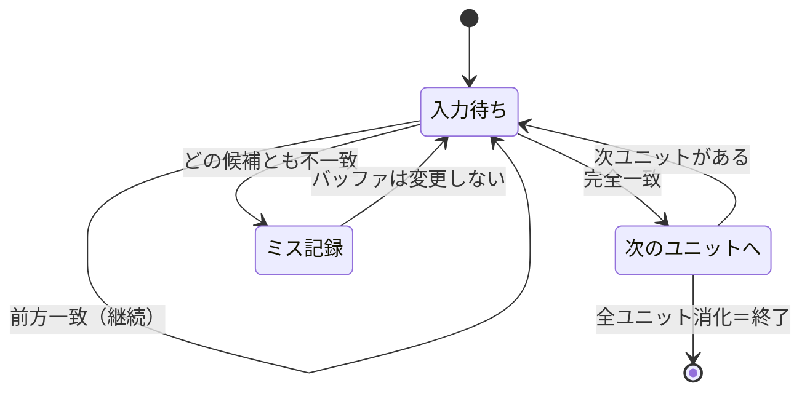

# 2. Design — 土台（core）構築

## 実装アプローチ

### 課題を「ユニットの列」として統一的に扱う

タッチタイプ・英単語・ローマ字の3種類は、見た目も入力方法も違うが、
「1文字ずつ照合する」か「複数の正解表記を許容する」かの違いに分解できる。
これを共通の形に落とし込み、`core/engine` が課題の種類を意識せずに判定できるようにする。

```ts
// src/core/types/challenge.ts
export type ChallengeUnit = {
  display: string;      // 画面に出す表記（例: "し"）
  accepted: string[];   // 正解として受理する入力（例: ["shi", "si"]）
};

export type Challenge = {
  displayText: string;     // 課題文全体（表示用）
  units: ChallengeUnit[];  // 判定単位の列
};
```

各課題の種類は `generate()` の中でこの `units` を組み立てるだけでよい。

| 課題の種類 | ユニットの切り方 | `accepted` の例 |
|------------|------------------|------------------|
| タッチタイプ | 1キー＝1ユニット | `["f"]` |
| 英単語 | 1文字＝1ユニット | `["c"]` |
| ローマ字 | 1モーラ（かな1〜2文字）＝1ユニット | `["shi", "si"]` |

これにより「し」を `si` でも `shi` でも正解にする要件（concept.md）は、
ローマ字変換モジュールが `accepted` に複数パターンを詰めるだけで満たせる。
判定エンジン自体はローマ字を特別扱いしない。

### 打鍵判定は「現在ユニットへの前方一致」で進める

ユーザーは1キーずつ打つため、ユニット全体が一致するまで単純比較はできない
（`shi` を待っている間に `s` だけ打たれた状態を「不正解」にしてはいけない）。

判定エンジンはユニットごとに入力バッファを持ち、キー入力のたびに次を判定する。

1. `buffer + key` が `accepted` のいずれかの **前方一致** なら、バッファに積む（継続中）
2. `buffer + key` が `accepted` のいずれかと **完全一致** なら、ユニット確定・次のユニットへ
3. どの `accepted` の前方一致にもならなければ **ミス**。`key_misses` に記録し、バッファは変えない（正しいキーを打つまでやり直させる）



### スコア計算

| 項目 | 計算式 |
|------|--------|
| 所要時間 | 開始キー入力〜最終ユニット確定までの経過時間（ms） |
| 正確さ | 完全一致で確定した打鍵数 ÷ 総打鍵数（ミス含む） |
| 速度 | 確定ユニット数（＝課題の文字数相当） ÷ 所要時間（分） |

「総打鍵数」にはミスした打鍵も含める。ミスした分だけ正確さが下がる形にする。

### registry は tasks 用・games 用を分けず、共通の入れ物を1つにする

architecture.md の型 `TypingTask` は課題・ゲームの両方が満たせる形（`id` / `label` / `generate()`）
になっているため、`core/registry` は種類を区別しない単一のレジストリとして作る。
「課題」「ゲーム」の区別は呼び出し側（`features/`）がどの登録済み `id` を一覧に出すかで行う。

```ts
// src/core/registry/registry.ts
export function register(task: TypingTask): void;
export function get(id: string): TypingTask | undefined;
export function list(): TypingTask[];
```

この work では実際の `tasks/` `games/` は作らないため、
テスト用のダミー課題を1つ登録・取得できることだけを確認する。

## 変更するファイル

| ファイル | 変更内容 |
|----------|----------|
| `src/core/types/challenge.ts` | `ChallengeUnit` / `Challenge` の型定義 |
| `src/core/types/task.ts` | `TypingTask` の型定義（architecture.md記載のものをそのまま実装） |
| `src/core/types/session.ts` | `Session`（速度・正確さ・所要時間）/ `KeyMiss` の型定義 |
| `src/core/engine/judge.ts` | ユニット単位の前方一致判定（キー入力→継続/確定/ミス） |
| `src/core/engine/score.ts` | 速度・正確さの計算 |
| `src/core/engine/romaji.ts` | かな→ローマ字の複数表記テーブルと変換 |
| `src/core/registry/registry.ts` | `register` / `get` / `list` |
| 各ファイルに対応する `*.test.ts` | 最低限のユニットテスト |

## 影響範囲

新規ファイルのみで、既存の `src/App.tsx` や `src/lib/supabase.ts` には触れない。
壊れる可能性のある既存機能はない。

## 確認方法

- `npm run test`：判定エンジン（前方一致・ミス記録）、ローマ字変換（`si`/`shi` 両対応）、
  スコア計算、registry の登録・取得をそれぞれユニットテストで確認する
- `npm run typecheck` / `npm run lint` が通ることを確認する
- `npm run dev` は雛形側で確認済みのため、この work では起動確認のみ（画面に変更はない）
