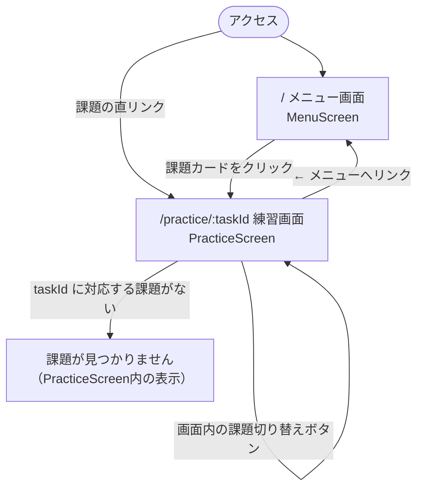

# 2. Design — メニュー画面追加とUIリニューアル（案B）

## ルーティング構成

- `src/main.tsx` に `BrowserRouter` を追加する（Appの外側で1回だけラップ）
- `src/App.tsx` に `Routes` を追加する

  ```
  / …………………… MenuScreen（メニュー）
  /practice/:taskId … PracticeScreen（練習画面）
  ```

- 画面が2つだけの現段階では、共通レイアウト用のルート（`Outlet`）はまだ作らない。
  各画面が自分で `AppHeader` を描画する形にする（画面が増えたら見直す）
- `App.tsx` の「疎通確認のため一時的に描画」コメントは削除し、正式なルーティングに置き換える

## 画面遷移図



- メニューを経由せず `/practice/:taskId` へ直接アクセスするルート（生徒が自分の
  担当課題だけを開いて動作確認する用途）も併記した
- 練習画面からメニューに戻る導線がこれまでの設計になかったため、
  `AppHeader` に「← メニューへ」リンクを追加する（メニュー画面自身では非表示）
- 課題切り替えボタンは同じ練習画面内でのURL遷移（`/practice/A` → `/practice/B`）であり、
  画面としては行き来せずそのまま留まる

## ディレクトリ変更

```
src/
├── App.tsx                          変更：Routes定義
├── main.tsx                         変更：BrowserRouter追加
├── index.css                        変更：デザイントークン追加
├── features/
│   ├── menu/                        新規
│   │   ├── MenuScreen.tsx
│   │   └── MenuScreen.test.tsx
│   └── practice/
│       ├── PracticeScreen.tsx       変更：useParams対応・UI刷新
│       └── PracticeScreen.test.tsx  変更：Router配下でのレンダーに対応
├── shared/                          新規（このディレクトリ自体は architecture.md で確保済み・実装は初）
│   └── ui/
│       ├── AppHeader.tsx
│       ├── Card.tsx
│       ├── PillButton.tsx
│       ├── ProgressRing.tsx
│       ├── KeyHintRow.tsx
│       └── icons.tsx
└── tasks/
    ├── index.ts                     変更：touch-type-dk の登録行を削除
    └── touch-type-dk/                削除
```

`docs/known-issues.md` No.1 の「なおした日」もあわせて記入する。

## 画面構成

### メニュー画面（`MenuScreen`）

- `AppHeader`（タイトル・タグライン。メニュー画面では「← メニューへ」リンクは表示しない）
- 登録課題一覧（`core/registry` の `list()` を利用）をカードで表示
  - 1課題＝1カード。アイコン（キーボード）＋課題ラベル
  - クリックで `/practice/${task.id}` へ `navigate`
- 課題が0件になることは運用上想定しないため、空表示のハンドリングは作らない
  （registryには常に最低1課題が登録される前提。`tasks/index.ts` が空になるのは
  開発中の異常系であり、画面側で救う必要はないと判断）

### 練習画面（`PracticeScreen`）

- `useParams<{ taskId: string }>()` で `taskId` を取得する
  （内部 `useState` によるtaskId管理はやめる。URLが唯一の情報源になる）
- `AppHeader`（「← メニューへ」リンク付き）
- 課題切り替え：`PillButton` を並べたもの。クリックで
  `navigate(`/practice/${id}`)`（同一画面内での `setState` ではなくルーティングで遷移する）
- `ChallengeCard`：マスコットアイコン＋えらんだ課題のラベル＋出題文（`displayText`）
- `TypingCard`：
  - `ProgressRing`（`unitIndex / units.length` を円グラフで表示）
  - 入力表示：入力済み（緑系）／次の1文字（アンバーで強調）の2区分は現状維持
    （その先の未入力は表示しない現行仕様を踏襲。`work/20260921-...`
    ではなく直近の `1_requirements.md` の合意通り）
  - `KeyHintRow`（下記「キーヒント表示の扱い」参照）
- リトライボタン：既存の挙動（同じchallengeを維持したままリセット）は変更しない
- `ResultCard`：速度／正確さをアイコン付きタイルで表示。ミスキーがあれば一覧表示、
  なければ「ミスなし！」の表示にする
- `taskId` に対応する課題がない場合（`get(taskId)` が `undefined`）は、
  現行と同じく「課題が見つかりません」の表示のままにする

## キーヒント表示の扱い（設計判断）

モックアップの「案B」では、次に打つキーを手元のキーボード図でハイライトしていた
（例：D と J を光らせる）。ただし本アプリの課題は `ChallengeUnit.accepted` に
複数文字のパターンを持てる（ローマ字入力で `し` → `["si", "shi"]` など）ため、
汎用的な物理キーボード図はすべての課題に対して意味を持たせられない。

対応方針：

- `KeyHintRow` は **固定8キー（A S D F ... J K L ;）** のみを描画する
- 現在のユニットの `accepted[0]` の先頭1文字がこの8キーに含まれる場合だけ、
  該当キーをハイライトして表示する
- 含まれない場合（英単語・ローマ字など）は `KeyHintRow` 自体を描画しない
  （タッチタイプ系の課題でだけ見える追加演出、という位置づけにする）

## デザイントークン（`index.css`）

CSS変数として色をまとめ、モックアップの配色をそのまま採用する。

```css
:root {
  --bg: #FAF7F2;
  --ink: #2B2620;
  --muted: #7A736A;
  --accent: #2F7D6B;
  --accent-soft: #E4F2EE;
  --warn: #E1A83B;
  --warn-soft: #FCEFD1;
  --border: #E7E1D6;
  --card-bg: #FFFFFF;
}
```

- 見出し・UI文字：Zen Maru Gothic（Google Fonts）
- 入力表示・課題文：JetBrains Mono（Google Fonts）
- フォントの `<link>` は `index.html` の `<head>` に追加する
- アイコンはすべて自前のインラインSVG（`shared/ui/icons.tsx` に集約）。
  **新規の外部UI/アイコンライブラリは追加しない**

## テスト方針

- `MenuScreen.test.tsx`：`MemoryRouter` 配下でレンダーし、
  - 登録課題がカードとして表示されること
  - カードクリックで該当 `taskId` のURLへ遷移すること（`useNavigate` のモック、または
    実際に `Routes` を組んで遷移後の画面を確認する）を検証する
- `PracticeScreen.test.tsx`：既存テストを `MemoryRouter initialEntries` 配下でのレンダーに
  書き換える。追加で以下を確認する
  - `/practice/:taskId` に存在しないIDでアクセスした場合に「課題が見つかりません」と出ること
  - 課題切り替えボタンでURLが遷移すること
- `App.test.tsx`：`/` へのアクセスでメニュー画面が表示される前提のまま、
  見出し `TypingSuite`（`AppHeader` 側に残す）が表示されることを確認する形に
  そのまま使える見込み（`AppHeader` をメニュー・練習画面の両方で使うため）

## 依存関係の変更

- `react-router-dom` を `package.json` の `dependencies` に追加する
  （`docs/architecture.md` で採用済みの技術のため、新規の技術決定としての承認は不要。
  依存追加そのものの実施として記載）
- 上記以外の新規依存は追加しない
